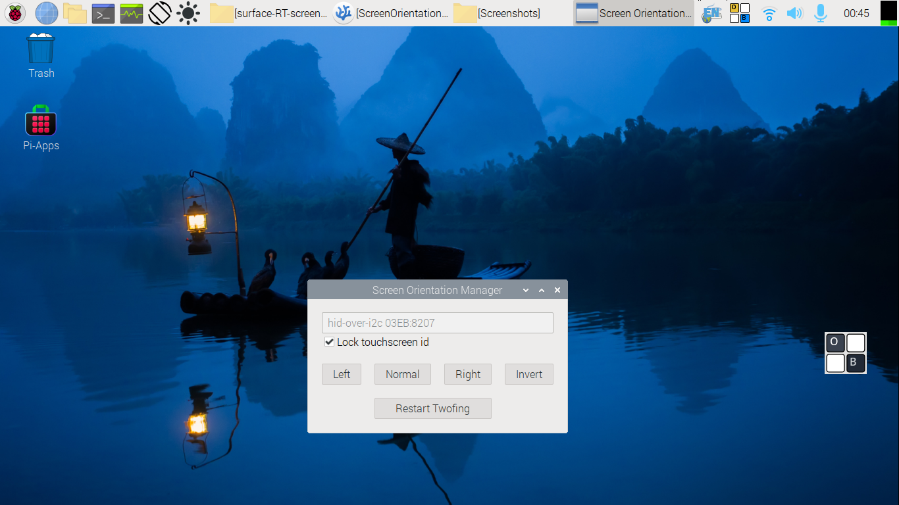

## Screen Rotator for Surface RT running GNU/Linux

Based on [theGeekyLad/GtkExperiments](https://github.com/theGeekyLad/GtkExperiments)
This app integrates twofing to enable two-finger gestures after screen rotation.

Tested in Surface RT [running Raspberry Pi OS](https://openrt.gitbook.io/open-surfacert/surface-rt/linux/root-filesystem/distros/raspberry-pi-os).

**Note**: You need to be on an **Xorg** session for results as unfortunately _Wayland isn't supported_ at the moment.

### Installation

#### Raspberry Pi OS
The following installation script installs [twofing](https://github.com/plippo/twofing) for two-finger gestures, and then installs this tool, and adds it to the **autostart** list. 

```
wget https://raw.githubusercontent.com/archisman-panigrahi/surface-RT-screen-rotator/surface-rt/srt-screen-rotation-setup.sh
bash srt-screen-rotation-setup.sh
```
And **reboot**.
If you don't want to set up twofing, and only want to use this tool, then use the `setup.sh` in this repository instead.

#### Arch Linux

Run the following commands one by one, and **reboot**.

```
yay -S twofing-git
cd && git clone https://github.com/archisman-panigrahi/surface-RT-screen-rotator
cd surface-RT-screen-rotator
bash move-files-around.sh
```
For autostart, either use the following command or use the appropriate settings in your desktop interface.
```
cp $HOME/.local/share/applications/surface-rt-screen-rotator.desktop $HOME/.config/autostart/
```

### Different device?

By default, the app uses the touchscreen id for Surface RT, for which the app was originally developed.
If you are using a different device, you can find the touchscreen id by running the command `xinput list`. Then edit the textbox in the app, and use the touchscreen id.

### Credits

- Thanks to @rubo77, for this project builds upon his shell script.
- Thanks to @theGeekyLad, as this project is a slightly modified version of their python application.
- Thanks to @Plippo for creating [twofing](https://github.com/plippo/twofing).
- The icon is based on GuLinux/ScreenRotator. Thanks to @GuLinux.
